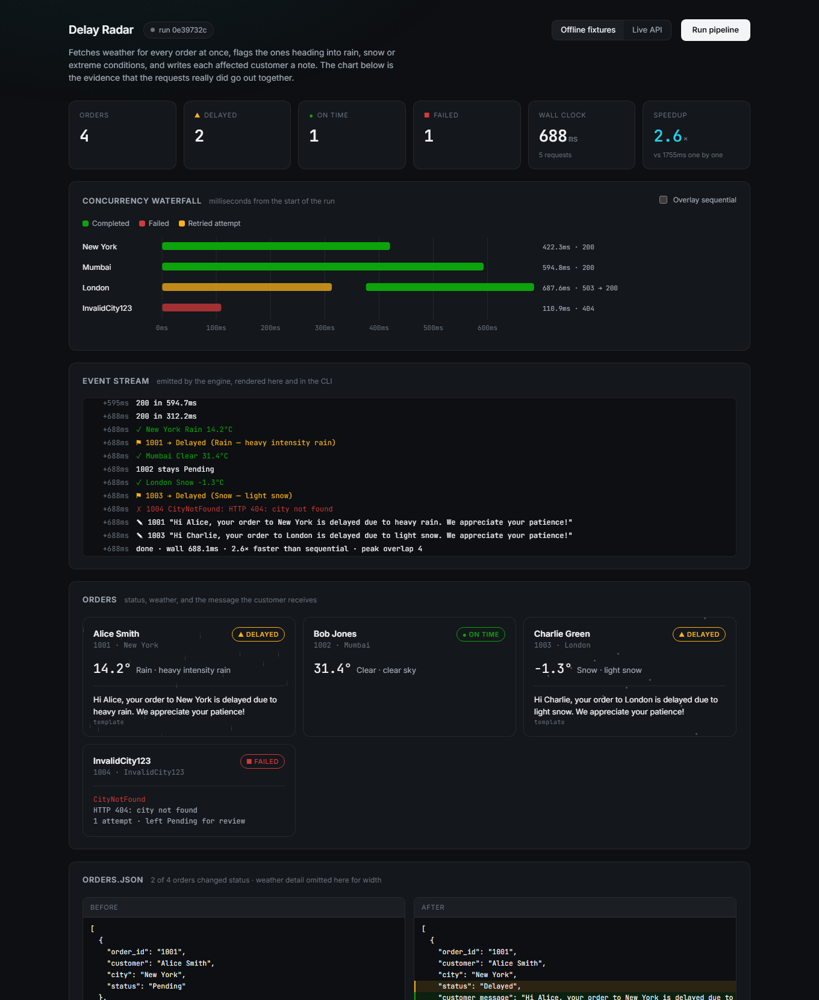

# Delay Radar

Checks the weather for every order's destination **at the same time**, flags the ones heading
into rain, snow or extreme conditions, writes each affected customer a note explaining why,
and does not fall over when a city doesn't exist.



> **Looking for the updated orders file?** It's
> **[`data/orders.processed.json`](data/orders.processed.json)**.
> `data/orders.json` is left byte-for-byte as the assignment supplied it, so every run starts
> from the same place and the before/after comparison stays meaningful. To rewrite it in
> place instead: `npm start -- --out data/orders.json`.

---

## Run it in fifteen seconds, without an API key

```bash
npm install
npm run demo
```

Offline mode swaps in a fake `fetch` — **not** a fake client — so retry, backoff, status
classification and response parsing are the same code the live path runs. One fixture returns
a 503 on its first attempt, so the retry logic is visible rather than merely claimed.

```
Delay Radar · run 348a7e8b · mock · 4 orders · max concurrency 8

  +   1ms → New York
  +   2ms → Mumbai
  +   2ms → London
  +   2ms → InvalidCity123
  + 304ms ↻ 1003 UpstreamError, retrying in 11ms
  + 620ms ✓ New York Rain, 14.2°C
  + 620ms ✗ 1004 CityNotFound: HTTP 404: city not found

  ─ Concurrency ──────────────────────────────────────

  New York     ██████████████████████████████        419.3ms 200
  Mumbai       ███████████████████████████████████   597.3ms 200
  London       ▓▓▓▓▓▓▓▓▓▓▓▓▓▓▓▓▓▓▓▓▓▓███████████████ 618.2ms 503→200
  InvalidCity… ▓▓▓▓▓▓▓▓▓                             119.1ms 404

  all 4 dispatched within 1.1ms · peak overlap 4 · 5 requests
  sequential 1738.4ms → wall 619.9ms  2.8× faster
```

**Against the real API:** put your key in `.env` (copy `.env.example`), then `npm start`.

**The dashboard:** `npm run dev`, then open <http://localhost:5173>. It runs the same engine
over an SSE stream and draws the waterfall live.

```bash
npm test          # 48 tests, no network
npm run typecheck
```

CI runs all of the above on every push, plus a full `npm run demo` — because the fixtures need
no key and no network, the whole pipeline is exercised in the build rather than just the units
([.github/workflows/ci.yml](.github/workflows/ci.yml)).

---

## Every requirement, and where it lives

| The brief asks for | Where it is |
|---|---|
| `orders.json` as the local database, those exact cities | [data/orders.json](data/orders.json), byte-identical to the assignment |
| Fetch weather for each order's city | [src/weather/client.ts](src/weather/client.ts) |
| **Concurrently — not one by one** | [src/pipeline/run.ts](src/pipeline/run.ts); proven by [tests/concurrency.test.ts](tests/concurrency.test.ts) and the waterfall |
| Rain / Snow / Extreme → `Delayed` | [src/pipeline/classify.ts](src/pipeline/classify.ts) |
| A weather-aware apology function | [src/pipeline/apology.ts](src/pipeline/apology.ts) |
| Handle `InvalidCity123`, log it, don't crash | [src/errors.ts](src/errors.ts) — typed as `CityNotFound`, non-fatal, exit code 0 |
| No hardcoded key; use `.env` | [src/config.ts](src/config.ts) — validated at boot, redacted everywhere |
| The updated `orders.json` | [data/orders.processed.json](data/orders.processed.json), plus a before/after view in the dashboard |
| An AI log of the prompts used | [AI_LOG.md](AI_LOG.md) |

Design decisions and trade-offs: [ARCHITECTURE.md](ARCHITECTURE.md).

---

## The part worth looking at

Any submission can put `Promise.all` on line 40 and assert in its README that the calls are
concurrent. The interesting question is how you'd *know*.

So every attempt is timed off a monotonic clock and the run reports numbers that would look
different if the fan-out were fake:

- **`dispatchSpreadMs`** — the gap between the first and last request leaving. Sequential code
  cannot produce ~1ms across four cities.
- **`maxOverlap`** — peak requests genuinely in flight, from a sweep over the attempt
  intervals. A loop with `await` inside it pins this to 1 no matter how fast it runs.
- **`speedup`** — sum of individual latencies over wall clock.

The dashboard's **Overlay sequential** toggle redraws the same run end-to-end, which is what
one-by-one would have cost. The tests assert the same properties directly, including the
inverse: turn the semaphore down to `1` and `maxOverlap` drops to 1 and the speedup collapses
to ~1×. A test that only passes because the machine is fast isn't proof.

---

## Resilience

A 404 and a 503 are not the same failure, and treating them the same is the mistake this
section exists to avoid. Retrying `InvalidCity123` three times with backoff spends five
seconds re-learning a permanent fact.

| Kind | Trigger | Retried? | Effect on the run |
|---|---|---|---|
| `CityNotFound` | 404 | no — permanent | stays `Pending`, tagged `needs_review`, logged; run continues |
| `AuthError` | 401 / 403 | no — fatal | aborts the remaining work with one actionable message |
| `RateLimited` | 429 | yes, honouring `Retry-After` | transparent |
| `UpstreamError` | 5xx | yes, jittered backoff | transparent |
| `NetworkError` / `Timeout` | socket / deadline | yes | transparent |
| `MalformedResponse` | 200 with the wrong shape | no | flagged; run continues |

Also: every request carries an `AbortController` deadline, backoff uses full jitter so a batch
of retries doesn't re-collide, and `orders.processed.json` is written to a temp file and
renamed so a crash can't truncate the deliverable.

The invalid city is a **reported outcome, not a failed run** — the process exits `0`. Only a
fatal condition like a rejected key exits non-zero.

---

## The apology

Default is a template that reads OpenWeatherMap's own `description`, so `light snow` and
`heavy intensity rain` produce different copy instead of one generic sentence:

> Hi Alice, your order to New York is delayed due to heavy rain. We appreciate your patience!
>
> Hi Charlie, your order to London is delayed due to light snow. We appreciate your patience!

Set `ANTHROPIC_API_KEY` and the same function calls Claude instead, falling back to the
template on any error, timeout, or refusal. The template stays the default so runs are
deterministic and work offline.

---

## Configuration

Everything is optional except the key. Defaults shown; see [.env.example](.env.example).

| Variable | Default | |
|---|---|---|
| `OWM_API_KEY` | — | required for `npm start`, unused by `npm run demo` |
| `ANTHROPIC_API_KEY` | — | switches the apology to the model tier |
| `MAX_CONCURRENCY` | `8` | ceiling on in-flight requests |
| `REQUEST_TIMEOUT_MS` | `8000` | per-attempt deadline |
| `MAX_ATTEMPTS` | `3` | permanent failures stop at 1 regardless |
| `BACKOFF_BASE_MS` / `BACKOFF_CAP_MS` | `250` / `4000` | full-jitter bounds |
| `DELAY_CONDITIONS` | `Rain,Snow,Extreme` | exactly the specified set |
| `EXTREME_ALIASES` | `false` | see below |

**On `Extreme`:** OpenWeatherMap doesn't return it as a `weather[0].main` value any more — it
was a grouping in the older API, and `Tornado`, `Squall` and `Ash` are what survived of it.
The shipped policy is literally the three conditions the assignment names; the alias map
exists behind a flag rather than being quietly assumed.

---

## Layout

```
src/
  config.ts        env loading, validation, key redaction
  errors.ts        the failure taxonomy
  result.ts        Result<T,E> — errors are values, not throws
  telemetry.ts     event bus + the concurrency metrics
  http/            retry with jittered backoff; semaphore + in-flight dedup
  weather/         OpenWeatherMap client; offline fixture fetch
  pipeline/        the fan-out, the delay policy, the apology
  report/          CLI renderer, atomic JSON write
  cli.ts           the script
  server.ts        SSE stream for the dashboard
web/               React dashboard (no chart library — the Gantt is hand-written SVG)
tests/             48 tests, fully mocked
```

The engine emits events and knows nothing about terminals, HTTP servers or React. The CLI,
the dashboard and the tests are three subscribers to one run.
